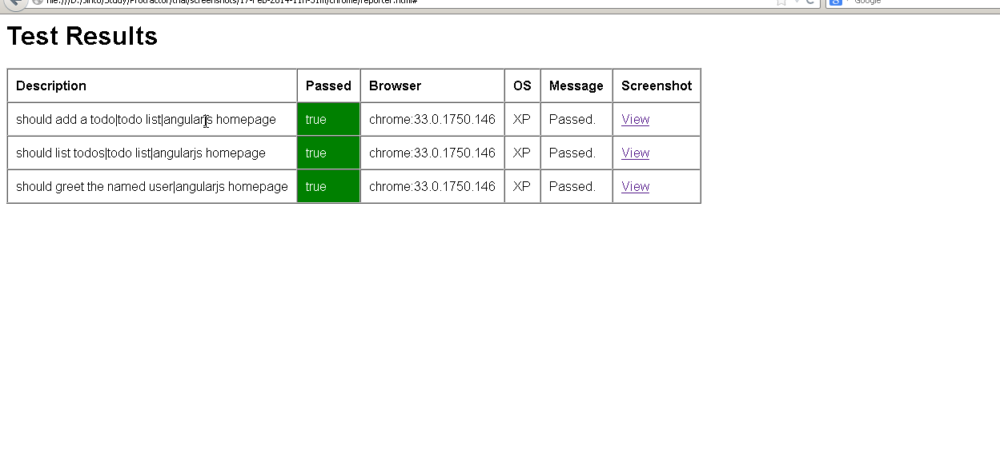

# Built on top of Screenshot Reporter for Protractor with HTML Reports and Screenshots

This is built on top of Screenshot Reporter for Protractor https://github.com/swissmanu/protractor-screenshot-reporter

For documentation, please see the original repository


## Usage
The `protractor-html-screenshot-reporter` module is available via npm:

```bash
$ npm install protractor-html-screenshot-reporter --save-dev
```

In your Protractor configuration file, register `protractor-screenshot-reporter-with-postprocessing` in Jasmine:

```javascript
var ScreenShotReporter = require('protractor-html-screenshot-reporter');

exports.config = {
   // your config here ...

   onPrepare: function() {
      // Add a screenshot reporter and store screenshots to `/tmp/screnshots`:
      jasmine.getEnv().addReporter(new ScreenShotReporter({
         baseDirectory: '/tmp/screenshots'
      }));
   }
}
```

## Postprocess Meta Data

On running the task via grunt, screenshot reporter will be generating json and png files for each test. 

With this postprocessing, you will get a json which has all the metadata, and also an html page showing the results. 




Please see the examples folder for a sample usage. 

For running the sample, do the following commands in the examples folder

```bash

$ npm install
$ grunt install
$ grunt test:e2e
```

After the test run, you can see that, a screenshots folder will be created with all the reports generated. 

Documentation for all options are available in the main repository (protractor-screenshot-reporter)


## License
Copyright (c) 2014 Manuel Alabor <manuel@alabor.me>

Permission is hereby granted, free of charge, to any person obtaining a copy of this software and associated documentation files (the "Software"), to deal in the Software without restriction, including without limitation the rights to use, copy, modify, merge, publish, distribute, sublicense, and/or sell copies of the Software, and to permit persons to whom the Software is furnished to do so, subject to the following conditions:

The above copyright notice and this permission notice shall be included in all copies or substantial portions of the Software.

THE SOFTWARE IS PROVIDED "AS IS", WITHOUT WARRANTY OF ANY KIND, EXPRESS OR IMPLIED, INCLUDING BUT NOT LIMITED TO THE WARRANTIES OF MERCHANTABILITY, FITNESS FOR A PARTICULAR PURPOSE AND NONINFRINGEMENT. IN NO EVENT SHALL THE AUTHORS OR COPYRIGHT HOLDERS BE LIABLE FOR ANY CLAIM, DAMAGES OR OTHER LIABILITY, WHETHER IN AN ACTION OF CONTRACT, TORT OR OTHERWISE, ARISING FROM, OUT OF OR IN CONNECTION WITH THE SOFTWARE OR THE USE OR OTHER DEALINGS IN THE SOFTWARE.

